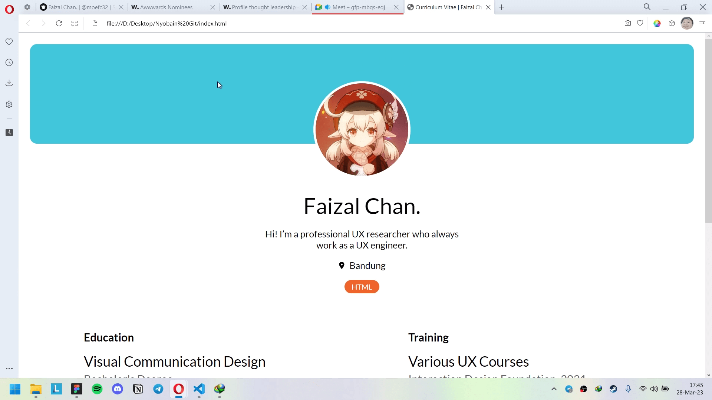

# Introduction to Frontend Development Kelas B 2023
**Fresh Graduate Academy, Digital Talent Scholarship oleh Kemkominfo RI**

Berikut adalah daftar anggota yang tergabung dalam kelas ini.

## Mentor
* [@moefc32](https://github.com/moefc32)

## Peserta
* [@andikadwikid](https://github.com/andikadwikid)
* [@AnisaHerawati](https://github.com/AnisaHerawati)
* [@Assivaa](https://github.com/Assivaa)
* [@Bagus1909](https://github.com/Bagus1909)
* [@Bayu212212](https://github.com/Bayu212212)
* [@churuninl](https://github.com/churuninl)
* [@Danielaryass](https://github.com/Danielaryass)
* [@denzalv](https://github.com/denzalv)
* [@devotodidak](https://github.com/devotodidak)
* [@hafidz345](https://github.com/hafidz345)
* [@imanmaulana1](https://github.com/imanmaulana1)
* [@jasminetsania](https://github.com/jasminetsania)
* [@junicotandiago198](https://github.com/junicotandiago198)
* [@kharismafajar23](https://github.com/kharismafajar23)
* [@lestrioktaviani](https://github.com/lestrioktaviani)
* [@mhdikhamal](https://github.com/mhdikhamal)
* [@mrpopo132](https://github.com/mrpopo132)
* [@muhajiralfath](https://github.com/muhajiralfath)
* [@Nashi0105](https://github.com/Nashi0105)
* [@raihanwn](https://github.com/raihanwn)
* [@Ramzbii](https://github.com/Ramzbii)
* [@ribertamat](https://github.com/ribertamat)
* [@rizkyfrdiansyah](https://github.com/rizkyfrdiansyah)
* [@thomi-h](https://github.com/thomi-h)
* [@utamianandaa](https://github.com/utamianandaa)
* [@wildanassegaf](https://github.com/wildanassegaf)
* [@wildanhabibie](https://github.com/wildanhabibie)
* [@y-majid16](https://github.com/y-majid16)
* [@zalfar](https://github.com/zalfar)

## Beberapa Kegiatan Kita

